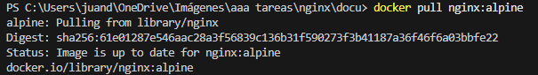
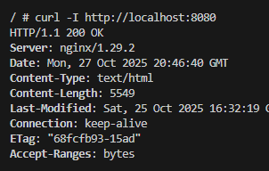
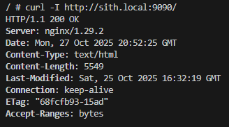

# 📸 Evidencias del despliegue “Jedi–Sith”

En esta sección se presentan las capturas de pantalla correspondientes a cada fase del proceso de despliegue del servidor web, demostrando el correcto funcionamiento y configuración del entorno.

---

## Fase 1 — Preparación del entorno web

**Descripción:**  
Se creó la estructura de carpetas `public/` y `config/` para almacenar los archivos estáticos (HTML, CSS, JS) de las aplicaciones “Jedi” y “Sith”.

*> Estructura de carpetas:*

*> Fase 1 final:*

---

## Fase 2 — Instalación del servidor web

**Descripción:**  
Se desplegó un contenedor Nginx basado en la imagen oficial `nginx:alpine`.  
Se comprobó que el contenedor se ejecuta correctamente con el comando `docker ps`.

*> docker pull:*

*> docker ps:*

*> docker exec:*

---

## Fase 3 — Configuración básica

**Descripción:**  
Se configuró Nginx para servir archivos estáticos desde las carpetas `public/jedi` y `public/sith`, utilizando distintos puertos para cada aplicación.  
Se verificó el acceso a través de `localhost`.

*> fase 3 final:*

*> curl ok:*

---

## Fase 4 — Configuración avanzada (dominios locales)

**Descripción:**  
Se añadieron dominios locales personalizados (`jedi.local` y `sith.local`) mediante la edición del archivo `/etc/hosts`.  
Se configuraron bloques virtuales en Nginx para responder en los puertos correspondientes.

*> curl jedi:*

*> curl sith:*

*> /etc/hosts:*

---

## Fase 5 — Verificación final

**Descripción:**  
Se comprobó el funcionamiento completo del entorno con ambas aplicaciones accesibles simultáneamente.  
Además, se verificó la correcta carga de estilos CSS personalizados (estética Jedi y Sith).

*> jedi:*

*> sith:*

---

## Conclusión visual

Ambas aplicaciones estáticas se sirven correctamente desde el mismo contenedor, demostrando modularidad y escalabilidad del entorno web.

